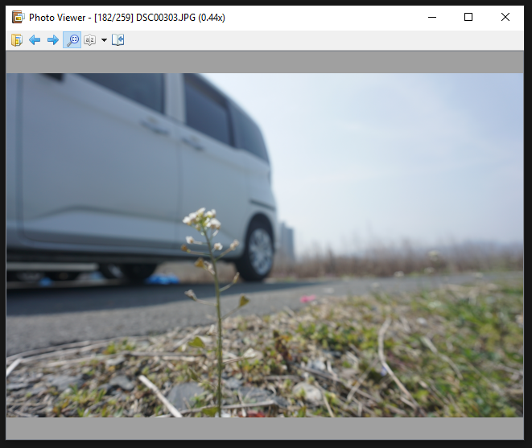

# simple-photo-viewer

A very simple photo viewer made in PySide2 / Qt. 

## Usage

Just run main.py. Working directory must be root of folder.

Requires: PySide2, PIL

## Controls

- Zooming in/out: Scroll wheel
- Panning: Middle mouse drag
- Next/Previous image: ,/. (comma and period)

## Credits

Some icons by [Yusuke Kamiyamane](http://p.yusukekamiyamane.com/). Licensed under a [Creative Commons Attribution 3.0 License](http://creativecommons.org/licenses/by/3.0/).